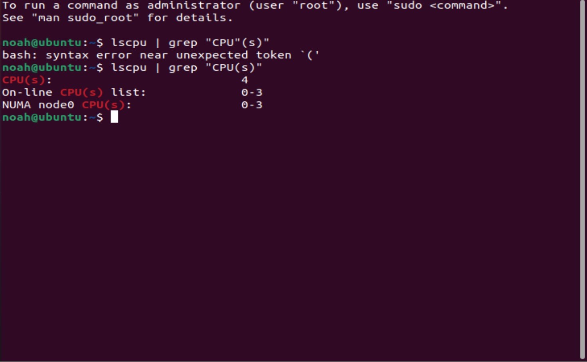
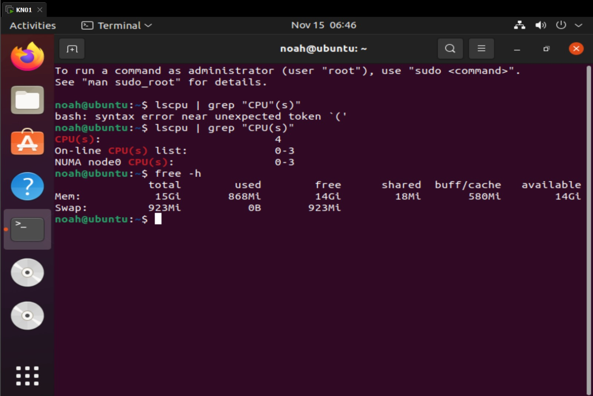

# Hypervisor – Übersicht

Ein **Hypervisor** ermöglicht es, mehrere virtuelle Maschinen (VMs) auf einem einzigen physischen Rechner auszuführen.
Dabei verwaltet er die Ressourcen wie CPU, Speicher und Speicherplatz.

## Typen von Hypervisoren

### Typ 1: Bare-Metal-Hypervisor
- Läuft direkt auf der Hardware ohne ein zugrunde liegendes Betriebssystem.  
- Effizienter und für professionelle Anwendungen geeignet.  
- Beispiele: VMware ESXi, Microsoft Hyper-V.  

### Typ 2: Hosted-Hypervisor
- Läuft auf einem bestehenden Betriebssystem.  
- Einfacher einzurichten, aber weniger performant.  
- Beispiele: VirtualBox, VMware Workstation.  

## Unterschied
- **Typ 1**: Direkter Hardwarezugriff, hohe Effizienz.  
- **Typ 2**: Abhängig vom Host-Betriebssystem, mehr Overhead.

---

---

# Hypervisor-Typ-Test und Ressourcenanalyse

## Vermutung des Hypervisor-Typs
Wir vermuten, dass unser System einen **Hypervisor Typ 2** verwendet, da wir unsere VM (VMware Workstation) auf einem bestehenden Betriebssystem nutzen.

---

## Schritte zur Überprüfung

### 1. Host-System überprüfen
- **Ressourcen des Host-Systems ausgelesen:**
  - **Logische Prozessoren:** [Anzahl eintragen]  
  - **RAM:** [Anzahl in GB eintragen]

### 2. Virtuelle Maschine erstellen
- **Erstellte VM:** Ubuntu 
- **Zugewiesene Ressourcen:**
  - Prozessoren: Mehr als die verfügbaren logischen Prozessoren des Host-Systems.  
  - RAM: Mehr als den verfügbaren RAM des Host-Systems.  

---

## Ergebnisse

### CPU-Test
Anzahl Prozessoren - Fehlermeldung:
 

lspu | grep "CPU(s)"

---

### RAM-Test
Anzahl RAM - Fehlermeldung: 

free -h

---

## Erklärung und Fazit

### Warum gibt es Fehlermeldungen?  
Es liegt daran, dass der Hypervisor nur die verfügbaren Ressourcen unseres Host-Systems nutzen kann. Das bestätig, dass es sich um einen Typ-2-Hypervisor handelt, der keine direkte Hardwaresteurung hat.

### Kuzes Fazit  
Unsere Vermutung, dass es sich um einen **Hypervisor Typ 2** handelt, wurde bestätigt.  
